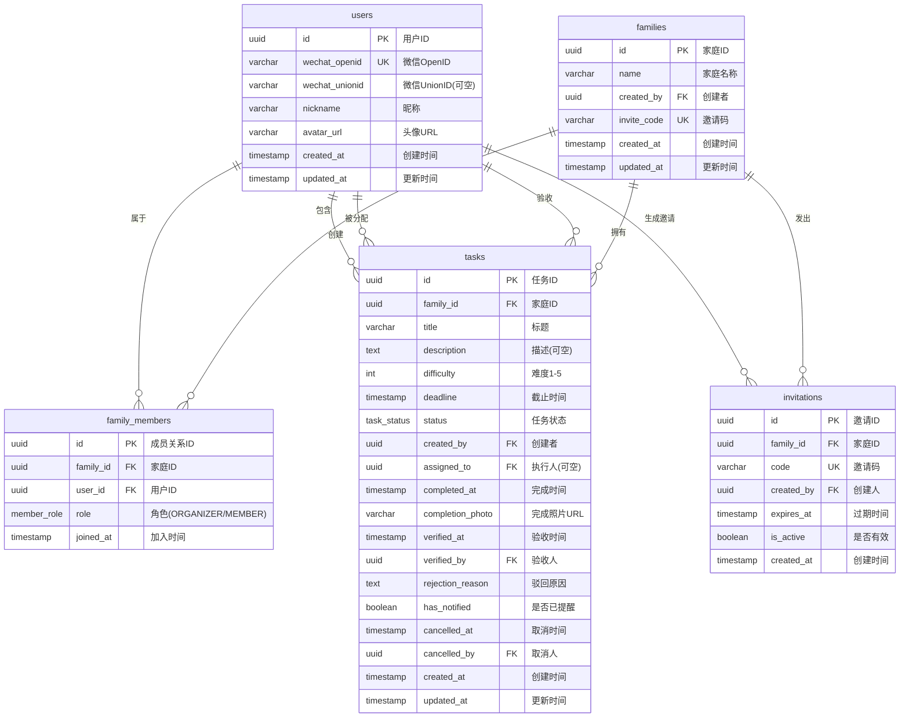

# 数据库设计文档

**版本**：v1.0  
**日期**：2026-06-10  
**依赖**：[requirements.md](./requirements.md)、[architecture.md](./architecture.md)  
**数据库**：PostgreSQL 16  
**ORM**：Prisma

---

## 1. 实体关系图 (ER Diagram)



---

## 2. 表结构详细说明

### 2.1 users — 用户表

| 字段 | 类型 | 约束 | 说明 |
|------|------|------|------|
| id | UUID | PK, DEFAULT gen_random_uuid() | 主键 |
| wechat_openid | VARCHAR(128) | NOT NULL, UNIQUE | 微信 OpenID，H5 和小程序不同 |
| wechat_unionid | VARCHAR(128) | NULLABLE, INDEX | 微信 UnionID，同一主体下打通账号 |
| nickname | VARCHAR(64) | NOT NULL | 微信昵称 |
| avatar_url | VARCHAR(512) | NULLABLE | 微信头像 URL |
| created_at | TIMESTAMPTZ | NOT NULL, DEFAULT NOW() | |
| updated_at | TIMESTAMPTZ | NOT NULL, DEFAULT NOW() | |

**索引**：
- `idx_users_wechat_openid` UNIQUE on (`wechat_openid`)
- `idx_users_wechat_unionid` on (`wechat_unionid`) — 用于 OpenID 不匹配时通过 UnionID 查找

**设计说明**：
- H5 公众号和小程序的 OpenID 是不同的，所以留 `wechat_unionid` 字段将来打通账号
- MVP 先用 OpenID 登录，后续可增加手机号绑定

---

### 2.2 families — 家庭表

| 字段 | 类型 | 约束 | 说明 |
|------|------|------|------|
| id | UUID | PK, DEFAULT gen_random_uuid() | 主键 |
| name | VARCHAR(64) | NOT NULL | 家庭名称，如"幸福的三口之家" |
| created_by | UUID | NOT NULL, FK → users.id | 创建者（自动成为组织者） |
| invite_code | VARCHAR(8) | NOT NULL, UNIQUE | 邀请码，如"ABC123" |
| created_at | TIMESTAMPTZ | NOT NULL, DEFAULT NOW() | |
| updated_at | TIMESTAMPTZ | NOT NULL, DEFAULT NOW() | |

**索引**：
- `idx_families_invite_code` UNIQUE on (`invite_code`)
- `idx_families_created_by` on (`created_by`)

**设计说明**：
- `invite_code` 生成规则：6位字母数字随机组合，不区分大小写
- 创建者自动以 ORGANIZER 角色加入 family_members

---

### 2.3 family_members — 家庭成员表

| 字段 | 类型 | 约束 | 说明 |
|------|------|------|------|
| id | UUID | PK, DEFAULT gen_random_uuid() | 主键 |
| family_id | UUID | NOT NULL, FK → families.id | 家庭ID |
| user_id | UUID | NOT NULL, FK → users.id | 用户ID |
| role | member_role | NOT NULL, DEFAULT 'MEMBER' | ORGANIZER 或 MEMBER |
| joined_at | TIMESTAMPTZ | NOT NULL, DEFAULT NOW() | 加入时间 |

**枚举 `member_role`**：
| 值 | 说明 | 权限 |
|----|------|------|
| ORGANIZER | 家庭组织者 | 创建/分配/验收/取消任务、邀请成员、移除成员 |
| MEMBER | 普通成员 | 查看任务、标记完成 |

**索引**：
- `idx_family_members_unique` UNIQUE on (`family_id`, `user_id`) — 一个用户在一个家庭中只有一条记录
- `idx_family_members_user_id` on (`user_id`) — 查询用户所属的所有家庭

**设计说明**：
- 一个用户可以加入多个家庭（如：自己的家庭 + 父母家庭）
- 当前 MVP 每个家庭只有一个 ORGANIZER（创建者），后续可扩展为多管理员

---

### 2.4 tasks — 任务表（核心）

| 字段 | 类型 | 约束 | 说明 |
|------|------|------|------|
| id | UUID | PK, DEFAULT gen_random_uuid() | 主键 |
| family_id | UUID | NOT NULL, FK → families.id | 所属家庭 |
| title | VARCHAR(128) | NOT NULL | 任务标题 |
| description | TEXT | NULLABLE | 任务描述/备注 |
| difficulty | SMALLINT | NOT NULL, DEFAULT 1, CHECK 1-5 | 难度 1(简单) ~ 5(困难) |
| deadline | TIMESTAMPTZ | NOT NULL | 截止时间 |
| status | task_status | NOT NULL, DEFAULT 'PENDING_ASSIGNMENT' | 任务状态 |
| created_by | UUID | NOT NULL, FK → users.id | 创建者 |
| assigned_to | UUID | NULLABLE, FK → users.id | 执行人（NULL = 待分配） |
| completed_at | TIMESTAMPTZ | NULLABLE | 成员标记完成的时间 |
| completion_photo | VARCHAR(512) | NULLABLE | 完成凭证照片 URL |
| verified_at | TIMESTAMPTZ | NULLABLE | 组织者验收通过的时间 |
| verified_by | UUID | NULLABLE, FK → users.id | 验收人 |
| rejection_reason | TEXT | NULLABLE | 驳回原因（验收不通过时） |
| has_notified | BOOLEAN | NOT NULL, DEFAULT FALSE | 是否已发送到期提醒 |
| cancelled_at | TIMESTAMPTZ | NULLABLE | 取消时间 |
| cancelled_by | UUID | NULLABLE, FK → users.id | 取消人 |
| created_at | TIMESTAMPTZ | NOT NULL, DEFAULT NOW() | |
| updated_at | TIMESTAMPTZ | NOT NULL, DEFAULT NOW() | |

**枚举 `task_status`**：
| 值 | 含义 | 下一个状态 |
|----|------|-----------|
| PENDING_ASSIGNMENT | 已创建，未分配执行人 | → PENDING_COMPLETION（分配） / CANCELLED（取消） |
| PENDING_COMPLETION | 已分配，等待执行 | → PENDING_VERIFICATION（成员完成） / CANCELLED（取消） |
| PENDING_VERIFICATION | 等待组织者验收 | → COMPLETED（通过） / PENDING_COMPLETION（驳回） / CANCELLED（取消） |
| COMPLETED | 已完成（最终状态） | — |
| CANCELLED | 已取消（最终状态） | — |

**索引**：
- `idx_tasks_family_id_status` on (`family_id`, `status`) — 按家庭+状态查询
- `idx_tasks_assigned_to_status` on (`assigned_to`, `status`) — 查某人的待办任务
- `idx_tasks_deadline_notified` on (`deadline`, `has_notified`) WHERE status = 'PENDING_COMPLETION' — 定时提醒任务扫描（部分索引）
- `idx_tasks_created_by` on (`created_by`)

**设计说明**：
- MVP 中任务完成时只需上传 **一张** 照片作为凭证
- `has_notified` 确保同个任务不会重复提醒
- `completed_at` 和 `verified_at` 同时记录，用于后期贡献统计

---

### 2.5 invitations — 邀请表

| 字段 | 类型 | 约束 | 说明 |
|------|------|------|------|
| id | UUID | PK, DEFAULT gen_random_uuid() | 主键 |
| family_id | UUID | NOT NULL, FK → families.id | 目标家庭 |
| code | VARCHAR(8) | NOT NULL, UNIQUE | 邀请码 |
| created_by | UUID | NOT NULL, FK → users.id | 创建人 |
| expires_at | TIMESTAMPTZ | NOT NULL | 过期时间（默认创建后 72 小时） |
| is_active | BOOLEAN | NOT NULL, DEFAULT TRUE | 是否有效 |
| created_at | TIMESTAMPTZ | NOT NULL, DEFAULT NOW() | |

**索引**：
- `idx_invitations_code` UNIQUE on (`code`)
- `idx_invitations_family_active` on (`family_id`, `is_active`)

**设计说明**：
- 邀请码加入逻辑：用户输入 code → 查找有效的 invitation → 在 family_members 中插入记录
- 一个家庭可有多个有效邀请码
- 组织者可以手动使邀请码失效（`is_active = false`）
- 微信分享实际分享的是带有 code 参数的 H5 链接

---

## 3. 索引策略总结

| 表 | 索引 | 类型 | 用途 |
|----|------|------|------|
| users | `idx_users_wechat_openid` | UNIQUE | 登录时根据 OpenID 查找用户 |
| users | `idx_users_wechat_unionid` | NORMAL | 账号打通 |
| families | `idx_families_invite_code` | UNIQUE | 通过邀请码查找家庭 |
| families | `idx_families_created_by` | NORMAL | 查询用户创建的家庭 |
| family_members | `idx_family_members_unique` | UNIQUE | 防止重复加入 |
| family_members | `idx_family_members_user_id` | NORMAL | 查询用户的家庭列表 |
| tasks | `idx_tasks_family_id_status` | COMPOSITE | 家庭任务看板（按状态筛选） |
| tasks | `idx_tasks_assigned_to_status` | COMPOSITE | 个人待办列表 |
| tasks | `idx_tasks_deadline_notified` | PARTIAL | 定时提醒扫描 |
| tasks | `idx_tasks_created_by` | NORMAL | 我创建的任务 |
| invitations | `idx_invitations_code` | UNIQUE | 加入家庭验证 |
| invitations | `idx_invitations_family_active` | COMPOSITE | 查询有效邀请 |

---

## 4. 关键 SQL 查询预估

### 4.1 家庭任务看板（最常用）

```sql
SELECT t.*, u.nickname as assignee_name, u.avatar_url
FROM tasks t
LEFT JOIN users u ON t.assigned_to = u.id
WHERE t.family_id = $1
  AND t.status = $2  -- 按状态筛选
ORDER BY t.deadline ASC
LIMIT 20 OFFSET $3;
-- 使用索引: idx_tasks_family_id_status
```

### 4.2 个人待办列表

```sql
SELECT t.*, f.name as family_name
FROM tasks t
JOIN families f ON t.family_id = f.id
WHERE t.assigned_to = $1
  AND t.status = 'PENDING_COMPLETION'
ORDER BY t.deadline ASC;
-- 使用索引: idx_tasks_assigned_to_status
```

### 4.3 到期提醒扫描（定时任务）

```sql
SELECT t.*, u.wechat_openid, f.name
FROM tasks t
JOIN users u ON t.assigned_to = u.id
JOIN families f ON t.family_id = f.id
WHERE t.status = 'PENDING_COMPLETION'
  AND t.has_notified = FALSE
  AND t.deadline BETWEEN NOW() AND NOW() + INTERVAL '1 hour';
-- 使用索引: idx_tasks_deadline_notified (部分索引)
```

---

## 5. 数据量预估 (MVP)

| 表 | 预估行数 (首年) | 说明 |
|----|---------------|------|
| users | ~5,000 | 假设 1000 个家庭，平均 5 人 |
| families | ~1,000 | |
| family_members | ~5,000 | 每人可加入 1-2 个家庭 |
| tasks | ~100,000 | 每天约 300 个任务创建 |
| invitations | ~2,000 | |

所有表数据量均在百万级以下，单表查询 + 索引完全满足性能要求。

---

## 6. 迁移策略

- **开发阶段**：使用 `prisma migrate dev` 自动生成迁移文件
- **生产部署**：使用 `prisma migrate deploy` 应用迁移
- **回滚**：Prisma 支持 `prisma migrate resolve` 标记回滚，但 MVP 阶段数据量小，手动处理
- **种子数据**：`prisma/seed.ts` 生成测试用户、家庭和示例任务
