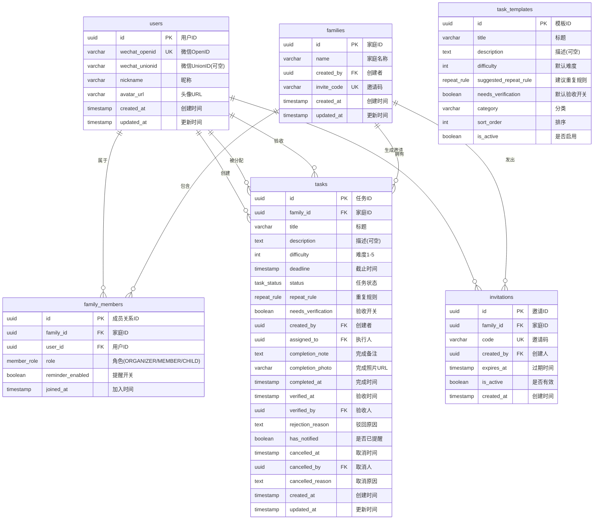

# 数据库设计文档

**版本**：v1.1
**日期**：2026-06-11
**依赖**：[requirements.md](./requirements.md)、[architecture.md](./architecture.md)
**数据库**：PostgreSQL 16
**ORM**：Prisma

> v1.1 变更摘要：新增 CHILD 角色、移除 PENDING_ASSIGNMENT 状态、新增 REJECTED 状态、任务表新增 4 个字段（completion_note / repeat_rule / needs_verification / cancelled_reason）、assigned_to 改为 NOT NULL、新增 task_templates 表、family_members 表新增 reminder_enabled 字段。

---

## 1. 实体关系图 (ER Diagram)



---

## 2. 表结构详细说明

### 2.1 users — 用户表

| 字段 | 类型 | 约束 | 说明 |
|------|------|------|------|
| id | UUID | PK, DEFAULT gen_random_uuid() | 主键 |
| wechat_openid | VARCHAR(128) | NOT NULL, UNIQUE | 微信 OpenID，H5 和小程序不同 |
| wechat_unionid | VARCHAR(128) | NULLABLE, INDEX | 微信 UnionID，同一主体下打通账号 |
| nickname | VARCHAR(64) | NOT NULL | 微信昵称 |
| avatar_url | VARCHAR(512) | NULLABLE | 微信头像 URL |
| created_at | TIMESTAMPTZ | NOT NULL, DEFAULT NOW() | |
| updated_at | TIMESTAMPTZ | NOT NULL, DEFAULT NOW() | |

**索引**：
- `idx_users_wechat_openid` UNIQUE on (`wechat_openid`)
- `idx_users_wechat_unionid` on (`wechat_unionid`) — 用于 OpenID 不匹配时通过 UnionID 查找

**设计说明**：
- H5 公众号和小程序的 OpenID 是不同的，所以留 `wechat_unionid` 字段将来打通账号
- MVP 先用 OpenID 登录，后续可增加手机号绑定

---

### 2.2 families — 家庭表

| 字段 | 类型 | 约束 | 说明 |
|------|------|------|------|
| id | UUID | PK, DEFAULT gen_random_uuid() | 主键 |
| name | VARCHAR(64) | NOT NULL | 家庭名称，如"幸福的三口之家" |
| created_by | UUID | NOT NULL, FK → users.id | 创建者（自动成为组织者） |
| invite_code | VARCHAR(8) | NOT NULL, UNIQUE | 邀请码，如"ABC123" |
| created_at | TIMESTAMPTZ | NOT NULL, DEFAULT NOW() | |
| updated_at | TIMESTAMPTZ | NOT NULL, DEFAULT NOW() | |

**索引**：
- `idx_families_invite_code` UNIQUE on (`invite_code`)
- `idx_families_created_by` on (`created_by`)

**设计说明**：
- `invite_code` 生成规则：6位字母数字随机组合，不区分大小写
- 创建者自动以 ORGANIZER 角色加入 family_members

---

### 2.3 family_members — 家庭成员表

| 字段 | 类型 | 约束 | 说明 |
|------|------|------|------|
| id | UUID | PK, DEFAULT gen_random_uuid() | 主键 |
| family_id | UUID | NOT NULL, FK → families.id | 家庭ID |
| user_id | UUID | NOT NULL, FK → users.id | 用户ID |
| role | member_role | NOT NULL, DEFAULT 'MEMBER' | ORGANIZER / MEMBER / CHILD |
| reminder_enabled | BOOLEAN | NOT NULL, DEFAULT TRUE | 提醒开关（按家庭+用户维度） |
| joined_at | TIMESTAMPTZ | NOT NULL, DEFAULT NOW() | 加入时间 |

**枚举 `member_role`**：
| 值 | 说明 | 权限 |
|----|------|------|
| ORGANIZER | 家庭组织者 | 创建/分配/验收/取消任何任务、邀请成员、移除成员 |
| MEMBER | 普通成员 | 查看任务、创建任务、标记完成、取消自己创建的任务 |
| CHILD | 孩子/青少年成员 | 查看任务、完成自己的任务；默认不可创建任务、不可邀请成员 |

**索引**：
- `idx_family_members_unique` UNIQUE on (`family_id`, `user_id`) — 一个用户在一个家庭中只有一条记录
- `idx_family_members_user_id` on (`user_id`) — 查询用户所属的所有家庭

**设计说明**：
- 一个用户可以加入多个家庭（如：自己的家庭 + 父母家庭）
- CHILD 是家庭内角色，系统不采集真实年龄等敏感信息
- `reminder_enabled` 按家庭维度存储，用户在不同家庭可有不同的提醒偏好
- MVP 每个家庭只有一个 ORGANIZER（创建者），后续可扩展为多管理员

---

### 2.4 tasks — 任务表（核心）

| 字段 | 类型 | 约束 | 说明 |
|------|------|------|------|
| id | UUID | PK, DEFAULT gen_random_uuid() | 主键 |
| family_id | UUID | NOT NULL, FK → families.id | 所属家庭 |
| title | VARCHAR(128) | NOT NULL | 任务标题 |
| description | TEXT | NULLABLE | 任务描述/备注 |
| difficulty | SMALLINT | NOT NULL, DEFAULT 1, CHECK 1-5 | 难度 1(简单) ~ 5(困难) |
| deadline | TIMESTAMPTZ | NOT NULL | 截止时间 |
| status | task_status | NOT NULL, DEFAULT 'PENDING_COMPLETION' | 任务状态 |
| repeat_rule | repeat_rule | NOT NULL, DEFAULT 'NONE' | 重复规则：NONE / DAILY / WEEKLY |
| needs_verification | BOOLEAN | NOT NULL, DEFAULT FALSE | 是否需要组织者验收 |
| created_by | UUID | NOT NULL, FK → users.id | 创建者 |
| assigned_to | UUID | NOT NULL, FK → users.id | 执行人（任务必须归属一个成员） |
| completion_note | TEXT | NULLABLE | 完成备注（执行人填写） |
| completion_photo | VARCHAR(512) | NULLABLE | 完成凭证照片 URL |
| completed_at | TIMESTAMPTZ | NULLABLE | 成员标记完成的时间 |
| verified_at | TIMESTAMPTZ | NULLABLE | 组织者验收通过的时间 |
| verified_by | UUID | NULLABLE, FK → users.id | 验收人 |
| rejection_reason | TEXT | NULLABLE | 驳回原因（验收不通过时，必填） |
| has_notified | BOOLEAN | NOT NULL, DEFAULT FALSE | 是否已发送到期提醒 |
| cancelled_at | TIMESTAMPTZ | NULLABLE | 取消时间 |
| cancelled_by | UUID | NULLABLE, FK → users.id | 取消人 |
| cancelled_reason | TEXT | NULLABLE | 取消原因（可选） |
| created_at | TIMESTAMPTZ | NOT NULL, DEFAULT NOW() | |
| updated_at | TIMESTAMPTZ | NOT NULL, DEFAULT NOW() | |

**枚举 `task_status`**：
| 值 | 含义 | 下一个状态 |
|----|------|-----------|
| PENDING_COMPLETION | 待完成（已分配执行人） | → PENDING_VERIFICATION（成员完成，需验收）/ COMPLETED（成员完成，无需验收）/ CANCELLED（取消） |
| PENDING_VERIFICATION | 等待组织者验收 | → COMPLETED（验收通过）/ REJECTED（驳回）/ CANCELLED（取消） |
| REJECTED | 已驳回 | → PENDING_COMPLETION（执行人重新提交）/ CANCELLED（取消） |
| COMPLETED | 已完成（最终状态） | — |
| CANCELLED | 已取消（最终状态） | — |

**计算状态（不存储，查询时动态计算）**：
| 状态 | 计算规则 | 用途 |
|------|----------|------|
| 临近到期 | status = PENDING_COMPLETION 且 deadline 在未来 1 小时内 | 首页提醒兜底 |
| 已逾期 | status = PENDING_COMPLETION 且 deadline < NOW() | 首页提醒兜底 |

**枚举 `repeat_rule`**：
| 值 | 说明 | 生成规则 |
|----|------|----------|
| NONE | 不重复 | 一次性任务 |
| DAILY | 每天 | 完成后生成 deadline + 1 天的新任务 |
| WEEKLY | 每周 | 完成后生成 deadline + 7 天的新任务 |

**索引**：
- `idx_tasks_family_id_status` on (`family_id`, `status`) — 家庭任务看板（按状态筛选）
- `idx_tasks_assigned_to_status` on (`assigned_to`, `status`) — 个人待办列表
- `idx_tasks_deadline_notified` on (`deadline`, `has_notified`) WHERE status = 'PENDING_COMPLETION' — 定时提醒任务扫描（部分索引）
- `idx_tasks_created_by` on (`created_by`)
- `idx_tasks_repeat_rule` on (`repeat_rule`) — 定时任务扫描需要重复生成的任务
- `idx_tasks_needs_verification` on (`needs_verification`) — 验收相关查询

**设计说明**：
- 任务创建时 `assigned_to` 必须指定执行人（v1.1 移除"待分配"状态，减少复杂度）
- `needs_verification = false` 时，成员标记完成直接进入 COMPLETED 状态
- `needs_verification = true` 时，成员标记完成后进入 PENDING_VERIFICATION 状态
- 驳回必须填写 `rejection_reason`，应用层校验
- `completion_note` 是成员完成时的可选备注，独立于任务描述
- `has_notified` 确保同一任务在同一个 deadline 周期内不会重复提醒
- MVP 只支持一张完成照片，`completion_photo` 存单张 URL

---

### 2.5 task_templates — 任务模板表（v1.1 新增）

| 字段 | 类型 | 约束 | 说明 |
|------|------|------|------|
| id | UUID | PK, DEFAULT gen_random_uuid() | 主键 |
| title | VARCHAR(128) | NOT NULL | 模板标题，如"洗碗" |
| description | TEXT | NULLABLE | 任务说明，如"用洗洁精认真洗，洗完擦干放回原位" |
| difficulty | SMALLINT | NOT NULL, DEFAULT 1, CHECK 1-5 | 建议难度 |
| suggested_repeat_rule | repeat_rule | NOT NULL, DEFAULT 'NONE' | 建议重复规则 |
| needs_verification | BOOLEAN | NOT NULL, DEFAULT FALSE | 默认是否需要验收 |
| category | VARCHAR(32) | NOT NULL, DEFAULT '家务' | 分类，如"厨房"、"清洁"、"洗衣" |
| sort_order | SMALLINT | NOT NULL, DEFAULT 0 | 排序（数字越小越靠前） |
| is_active | BOOLEAN | NOT NULL, DEFAULT TRUE | 是否启用（可下架模板） |
| created_at | TIMESTAMPTZ | NOT NULL, DEFAULT NOW() | |
| updated_at | TIMESTAMPTZ | NOT NULL, DEFAULT NOW() | |

**索引**：
- `idx_task_templates_category` on (`category`)
- `idx_task_templates_active_sort` on (`is_active`, `sort_order`)

**设计说明**：
- 提供内置模板，用于快速创建常见家务任务
- 用户选择模板后，表单自动预填标题、描述、难度、重复规则、验收设置
- 模板仅提供默认值，用户可在创建时修改任意字段
- 内置模板示例：洗碗、倒垃圾、拖地、洗衣服、整理房间、擦桌子、做饭、遛狗、浇花

---

### 2.6 invitations — 邀请表

| 字段 | 类型 | 约束 | 说明 |
|------|------|------|------|
| id | UUID | PK, DEFAULT gen_random_uuid() | 主键 |
| family_id | UUID | NOT NULL, FK → families.id | 目标家庭 |
| code | VARCHAR(8) | NOT NULL, UNIQUE | 邀请码 |
| created_by | UUID | NOT NULL, FK → users.id | 创建人 |
| expires_at | TIMESTAMPTZ | NOT NULL | 过期时间（默认创建后 72 小时） |
| is_active | BOOLEAN | NOT NULL, DEFAULT TRUE | 是否有效 |
| created_at | TIMESTAMPTZ | NOT NULL, DEFAULT NOW() | |

**索引**：
- `idx_invitations_code` UNIQUE on (`code`)
- `idx_invitations_family_active` on (`family_id`, `is_active`)

**设计说明**：
- 邀请码加入逻辑：用户输入 code → 查找有效的 invitation → 在 family_members 中插入记录
- 一个家庭可有多个有效邀请码
- 组织者可以手动使邀请码失效（`is_active = false`）
- 微信分享实际分享的是带有 code 参数的 H5 链接

---

## 3. 索引策略总结

| 表 | 索引 | 类型 | 用途 |
|----|------|------|------|
| users | `idx_users_wechat_openid` | UNIQUE | 登录时根据 OpenID 查找用户 |
| users | `idx_users_wechat_unionid` | NORMAL | 账号打通 |
| families | `idx_families_invite_code` | UNIQUE | 通过邀请码查找家庭 |
| families | `idx_families_created_by` | NORMAL | 查询用户创建的家庭 |
| family_members | `idx_family_members_unique` | UNIQUE | 防止重复加入 |
| family_members | `idx_family_members_user_id` | NORMAL | 查询用户的家庭列表 |
| tasks | `idx_tasks_family_id_status` | COMPOSITE | 家庭任务看板（按状态筛选） |
| tasks | `idx_tasks_assigned_to_status` | COMPOSITE | 个人待办列表 |
| tasks | `idx_tasks_deadline_notified` | PARTIAL | 定时提醒扫描 |
| tasks | `idx_tasks_created_by` | NORMAL | 我创建的任务 |
| tasks | `idx_tasks_repeat_rule` | NORMAL | 重复任务生成扫描 |
| tasks | `idx_tasks_needs_verification` | NORMAL | 验收相关查询 |
| task_templates | `idx_task_templates_category` | NORMAL | 按分类获取模板 |
| task_templates | `idx_task_templates_active_sort` | COMPOSITE | 获取启用的模板列表 |
| invitations | `idx_invitations_code` | UNIQUE | 加入家庭验证 |
| invitations | `idx_invitations_family_active` | COMPOSITE | 查询有效邀请 |

---

## 4. 关键 SQL 查询预估

### 4.1 家庭任务看板（最常用）

```sql
SELECT t.*, u.nickname as assignee_name, u.avatar_url
FROM tasks t
LEFT JOIN users u ON t.assigned_to = u.id
WHERE t.family_id = $1
  AND t.status = $2  -- 按状态筛选
ORDER BY t.deadline ASC
LIMIT 20 OFFSET $3;
-- 使用索引: idx_tasks_family_id_status
```

### 4.2 个人待办列表（含计算状态）

```sql
SELECT t.*, f.name as family_name
FROM tasks t
JOIN families f ON t.family_id = f.id
WHERE t.assigned_to = $1
  AND t.status IN ('PENDING_COMPLETION', 'REJECTED')
ORDER BY
  CASE WHEN t.status = 'REJECTED' THEN 0 ELSE 1 END,  -- 被驳回的优先显示
  t.deadline ASC;
-- 使用索引: idx_tasks_assigned_to_status
```

### 4.3 首页提醒兜底查询（临近到期 + 已逾期）

```sql
-- 临近到期（未来1小时内）
SELECT t.*, f.name as family_name
FROM tasks t
JOIN families f ON t.family_id = f.id
WHERE t.assigned_to = $1
  AND t.status = 'PENDING_COMPLETION'
  AND t.deadline BETWEEN NOW() AND NOW() + INTERVAL '1 hour'
ORDER BY t.deadline ASC;

-- 已逾期（超过截止时间）
SELECT t.*, f.name as family_name
FROM tasks t
JOIN families f ON t.family_id = f.id
WHERE t.assigned_to = $1
  AND t.status = 'PENDING_COMPLETION'
  AND t.deadline < NOW()
ORDER BY t.deadline ASC;
-- 使用索引: idx_tasks_assigned_to_status
```

### 4.4 到期提醒扫描（定时任务，含提醒开关检查）

```sql
SELECT t.*, u.wechat_openid, f.name as family_name
FROM tasks t
JOIN users u ON t.assigned_to = u.id
JOIN families f ON t.family_id = f.id
JOIN family_members fm ON fm.family_id = t.family_id AND fm.user_id = t.assigned_to
WHERE t.status = 'PENDING_COMPLETION'
  AND t.has_notified = FALSE
  AND t.deadline BETWEEN NOW() AND NOW() + INTERVAL '1 hour'
  AND fm.reminder_enabled = TRUE;  -- 检查提醒开关
-- 使用索引: idx_tasks_deadline_notified (部分索引)
```

### 4.5 家庭看板统计（每人待办数 + 本周完成数）

```sql
-- 每个成员当前待办数
SELECT t.assigned_to, u.nickname, COUNT(*) as pending_count
FROM tasks t
JOIN users u ON t.assigned_to = u.id
WHERE t.family_id = $1
  AND t.status IN ('PENDING_COMPLETION', 'REJECTED')
GROUP BY t.assigned_to, u.nickname;

-- 每个成员本周完成数
SELECT t.assigned_to, u.nickname, COUNT(*) as weekly_completed
FROM tasks t
JOIN users u ON t.assigned_to = u.id
WHERE t.family_id = $1
  AND t.status = 'COMPLETED'
  AND t.verified_at >= date_trunc('week', NOW())
GROUP BY t.assigned_to, u.nickname;
```

### 4.6 重复任务生成（定时任务）

```sql
-- 查找需要生成下一次实例的重复任务
SELECT t.*
FROM tasks t
WHERE t.status = 'COMPLETED'
  AND t.repeat_rule != 'NONE'
  AND NOT EXISTS (
    -- 检查是否已经生成了下一次任务
    SELECT 1 FROM tasks t2
    WHERE t2.family_id = t.family_id
      AND t2.title = t.title
      AND t2.assigned_to = t.assigned_to
      AND t2.created_at > t.completed_at
  );
-- 使用索引: idx_tasks_repeat_rule
```

---

## 5. 数据量预估 (MVP)

| 表 | 预估行数 (首年) | 说明 |
|----|---------------|------|
| users | ~5,000 | 假设 1000 个家庭，平均 5 人 |
| families | ~1,000 | |
| family_members | ~5,000 | 每人可加入 1-2 个家庭 |
| tasks | ~100,000 | 每天约 300 个任务创建 |
| task_templates | ~20 | 内置模板，固定数据 |
| invitations | ~2,000 | |

所有表数据量均在百万级以下，单表查询 + 索引完全满足性能要求。

---

## 6. 迁移策略

- **开发阶段**：使用 `prisma migrate dev` 自动生成迁移文件
- **生产部署**：使用 `prisma migrate deploy` 应用迁移
- **回滚**：Prisma 支持 `prisma migrate resolve` 标记回滚，但 MVP 阶段数据量小，手动处理
- **种子数据**：`prisma/seed.ts` 生成测试用户、家庭、示例任务和内置模板
